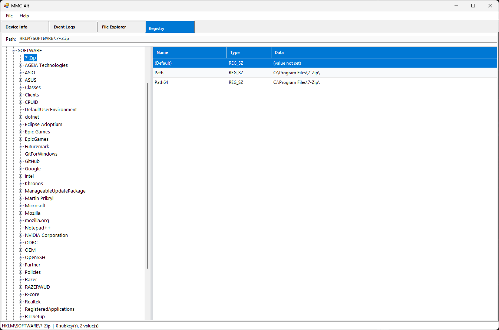
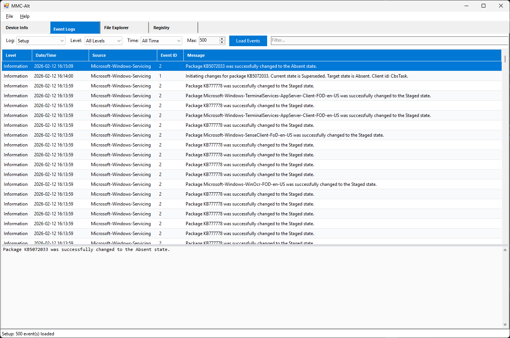
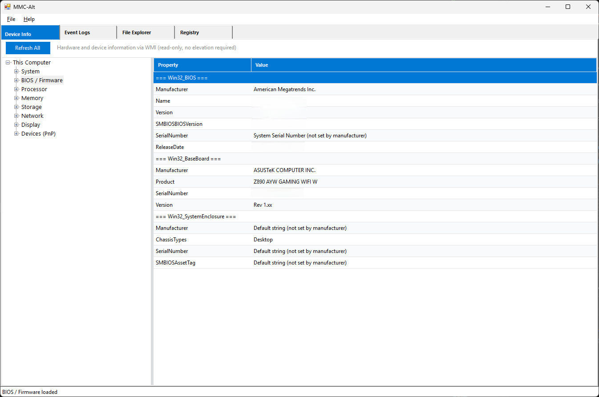
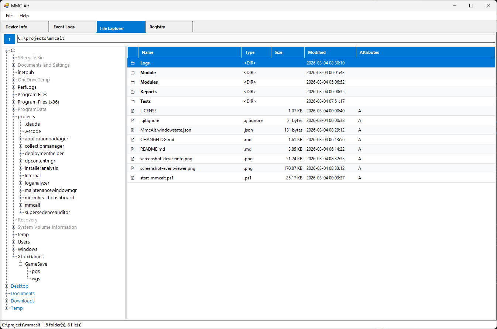

# MMC-Alt

Plugin-based PowerShell WinForms shell providing alternatives to Windows tools blocked by mmc.exe restrictions.

## What It Does

Many organizations block `mmc.exe` execution (via endpoint protection policies like SentinelOne), which disables every MMC-hosted tool: regedit, Event Viewer, Device Manager, and all MMC snap-ins. However, the underlying .NET APIs and WMI classes that these snap-ins wrap are fully accessible without elevation.

MMC-Alt provides a modular GUI shell that loads plugin modules, each offering an alternative to a blocked tool.

## Screenshots

| Registry Browser | Event Log Viewer |
|---|---|
|  |  |

| Device Info | File Explorer |
|---|---|
|  |  |

## Modules

### Registry Browser

Read-only registry browser for HKLM, HKCR, HKU, and HKCC with full read-write for HKCU.

- Regedit-style TreeView with lazy-loaded subkeys and values grid
- Address bar with direct path navigation (supports both short names like `HKLM` and full names like `HKEY_LOCAL_MACHINE`)
- HKCU write operations: create/delete keys, create/modify/delete values
- Type-aware value editor supporting REG_SZ, REG_DWORD, REG_QWORD, REG_BINARY, REG_MULTI_SZ, REG_EXPAND_SZ
- Context menus: Copy Key Path, Copy Value Data, Refresh
- Search (Ctrl+F): find by key name, value name, or value data
- Graceful handling of access-denied keys

### Event Log Viewer

Browse Windows event logs without Event Viewer (`eventvwr.msc`).

- Reads Application, System, Security, and Setup logs via `Get-WinEvent`
- Filter by severity level, time range (1 hour to 30 days), and free-text search
- Configurable max events (50-10,000) for performance control
- Color-coded severity rows (Critical, Error, Warning, Information)
- Detail panel showing full event message on row selection
- Graceful handling of access-denied logs (e.g., Security)

### Device Info

WMI-based system information viewer, replacing Device Manager and System Information snap-ins.

- 8 categories: System, BIOS/Firmware, Processor, Memory, Storage, Network, Display, Devices
- Formatted display values (byte sizes, MHz speeds, network rates, drive types)
- PnP device listing with problem device filtering
- Copy individual values or all properties to clipboard

### File Explorer

Alternative file browser with admin-friendly defaults.

- Hidden files and file extensions shown by default, sorted by type
- Drive roots and quick-access folders (Desktop, Documents, Downloads, Temp)
- 7-Zip integration for browsing archive contents when 7-Zip is installed
- Navigate into archives as virtual folders
- File attributes displayed as compact flags (H/S/R/A)

## Plugin Architecture

MMC-Alt discovers modules from the `Modules/` folder at startup. Each module is a subfolder containing:

- `module.json` -- plugin manifest (name, tab label, version, entry script)
- Entry script (`.ps1`) -- defines an initialization function that builds UI on a provided TabPage

To add a new module, create a new folder under `Modules/` with these files.

## Prerequisites

| Requirement | Details |
|---|---|
| **OS** | Windows 10/11 or Windows Server 2016+ |
| **PowerShell** | 5.1 (ships with Windows) |
| **.NET Framework** | 4.8+ (required by WinForms GUI) |

No admin rights, no MECM console, and no mmc.exe required.

**Optional:** [7-Zip](https://www.7-zip.org/) installed for archive browsing in the File Explorer module.

## Usage

1. Open PowerShell and navigate to the project directory.

2. Launch the GUI:
   ```powershell
   .\start-mmcalt.ps1
   ```

3. All discovered modules load as tabs: Registry, Event Logs, Device Info, File Explorer.

4. To edit HKCU registry values, right-click a key or value for context menu options.

## Keyboard Shortcuts

| Shortcut | Context | Action |
|---|---|---|
| Ctrl+F | Registry Browser | Search keys, values, and data |
| F5 | Registry Browser | Refresh selected key |
| Enter | Address bar (Registry/File Explorer) | Navigate to typed path |

## License

MIT
