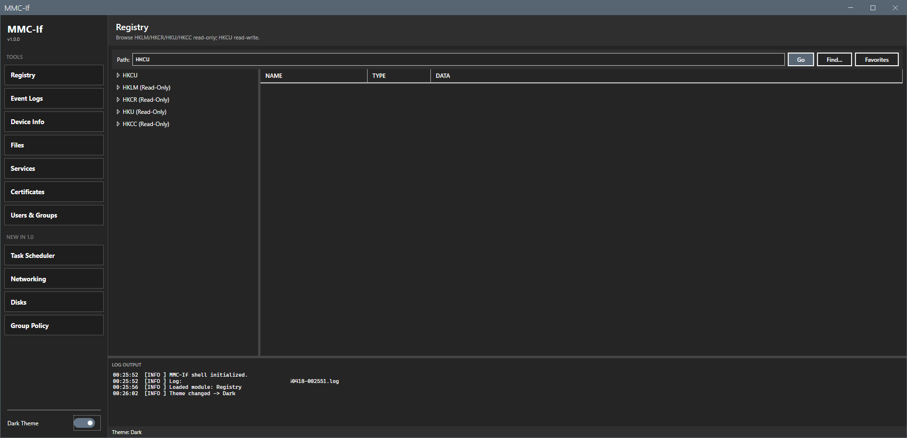
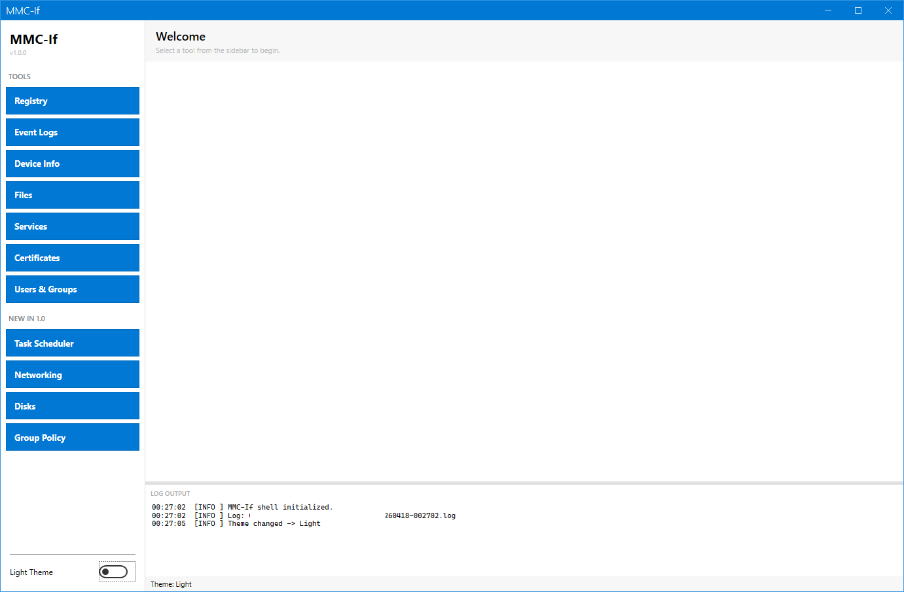
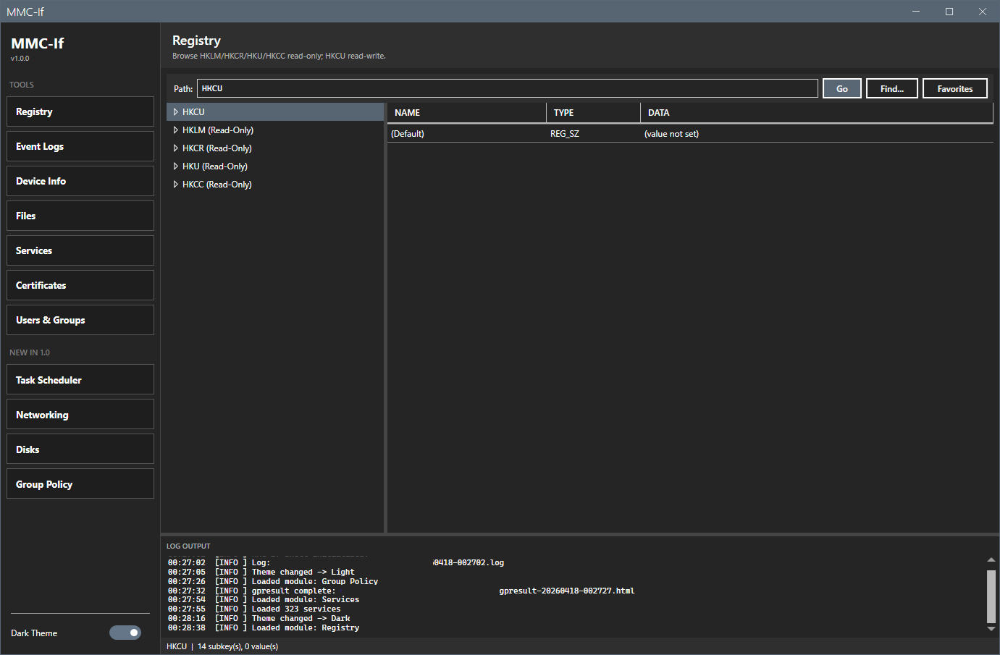
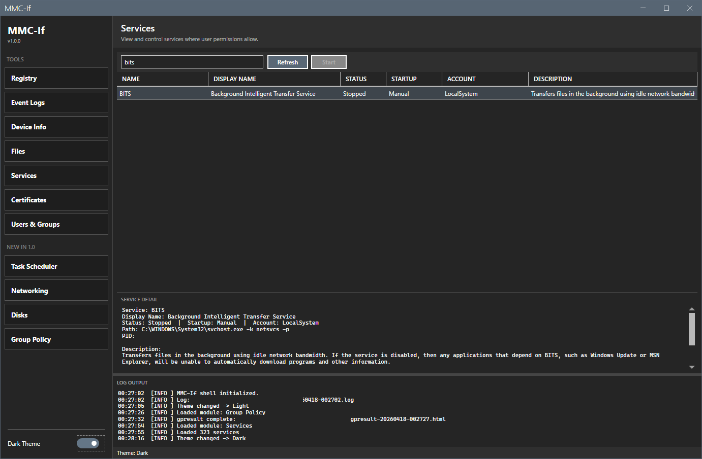

# MMC-If

Plugin-based PowerShell / WPF shell that replaces the common MMC snap-ins
on endpoints where `mmc.exe` is blocked by endpoint protection.

## What It Does

Many enterprise environments block `mmc.exe` execution via SentinelOne,
Defender for Endpoint, AppLocker, or local GPO. That single block disables
every MMC-hosted snap-in at once: regedit, Event Viewer, Device Manager,
Task Scheduler, services.msc, certlm.msc, lusrmgr.msc, diskmgmt.msc,
gpedit.msc, and the rest. The underlying .NET APIs and CIM classes the
snap-ins wrap are still accessible without elevation.

MMC-If is a WPF shell that loads module plugins on demand. Each module
replaces one blocked snap-in using the PowerShell cmdlets and .NET APIs
the snap-in was wrapping anyway. No admin rights, no MECM console, no
`mmc.exe`.




Module examples:




## Prerequisites

| Requirement | Details |
|---|---|
| **OS** | Windows 10/11 or Windows Server 2016+ |
| **PowerShell** | 5.1 (ships with Windows) |
| **.NET Framework** | 4.7.2+ (required by WPF + MahApps.Metro) |

**Optional:** [7-Zip](https://www.7-zip.org/) installed for archive browsing in the File Explorer module.

## Setup

1. Clone the repository:
   ```
   git clone https://github.com/jasonulbright/mmc-if.git
   ```

2. Open PowerShell and navigate to the project directory:
   ```powershell
   cd mmc-if
   ```

3. Launch the shell:
   ```powershell
   .\start-mmcif.ps1
   ```

No install step. The shell loads modules from the `Modules/` folder automatically.

## Modules

### Registry Browser
Read-only browser for HKLM, HKCR, HKU, HKCC; read-write for HKCU with no UAC elevation. Regedit-style TreeView with lazy subkey loading, values grid, and an address bar that accepts short (`HKCU\Software\...`) or long (`HKEY_CURRENT_USER\Software\...`) paths. HKCU writes support REG_SZ, REG_DWORD, REG_QWORD, REG_BINARY, REG_MULTI_SZ, REG_EXPAND_SZ. Ctrl+F searches keys, value names, and data. Export any hive to a `.reg` file; import a `.reg` file into HKCU only, with a preview dialog that blocks the apply step if any operation targets a non-HKCU key. Favorites menu saves bookmarked keys across sessions.

### Event Log Viewer
Browses Application, System, Security, and Setup via `Get-WinEvent`. Filter by severity, time range, and free-text search. Configurable max events (50 to 10,000). Color-coded severity rows with a detail panel for the full event message. Access-denied logs are handled gracefully.

### Device Info
CIM-based system information across eight categories: System, BIOS/Firmware, Processor, Memory, Storage, Network, Display, and Devices. Formatted values for byte sizes, MHz speeds, network rates, and drive types. PnP device listing with problem-device filtering. Copy individual values or full property sets to clipboard.

### File Explorer
Admin-friendly alternative file browser. Hidden files and extensions shown by default. Drive roots plus quick-access folders (Desktop, Documents, Downloads, Temp). 7-Zip integration lets you browse archive contents as virtual folders when 7-Zip is installed. File attributes render as compact H/S/R/A flags.

### Services
Service list from `Get-CimInstance Win32_Service`. Start, stop, restart with confirmation dialogs. Name/display-name filter. Detail pane with description, path, PID, and dependency lists.

### Certificate Store
Browses CurrentUser and LocalMachine certificate stores via .NET `X509Store`, read-only. Expiry coloring (expired red, within 30 days orange). Detail panel with subject, issuer, serial, thumbprint, SAN, template, and key usage.

### Users & Groups
Local users and groups via `Get-LocalUser` / `Get-LocalGroup`. Toggle between Users and Groups with a dropdown. User properties: name, full name, enabled, password last set, last logon. Group properties: name, description, member count. Detail panel shows group memberships or group members.

### Task Scheduler
Alternative to `taskschd.msc`. Enumerates scheduled tasks via `Get-ScheduledTask`, with a hide-Microsoft toggle. Detail panel shows triggers, actions, principal, and settings. Read-only.

### Networking
Alternative to `ncpa.cpl`. Adapters and IP config via `Get-NetAdapter` and `Get-NetIPAddress`. Detail panel shows IP, DNS, gateway; ping and tracert quick actions. Read-only.

### Disks
Alternative to `diskmgmt.msc`, read-only. Stacked grids for `Get-Disk`, `Get-Partition`, and `Get-Volume` with size, free space, file system, drive letter, and partition style.

### Group Policy
Runs `gpresult /h` and `/r` with an Open HTML Report button that launches the rendered report in the default browser. Read-only.

## Plugin Architecture

MMC-If discovers modules from the `Modules/` folder at startup. Each module is a subfolder containing:

- `module.json` — plugin manifest (Name, TabLabel, Version, EntryScript, InitFunction, UI)
- Entry `.ps1` — defines an initialization function that receives a shared Context hashtable and returns the module's WPF `UserControl`
- Companion `.xaml` — the UserControl layout

The shared `Context` gives every module:

| Field | Purpose |
|---|---|
| `Prefs` | Loaded preferences object | 
| `SavePrefs` | Scriptblock that persists current prefs to disk |
| `SetStatus` | Updates the shell's status bar |
| `Log` | Adds a line to the shared log drawer and log file |
| `Window` | The shell's `System.Windows.Window` (for owner-relative dialogs) |

## Project Structure

```
mmc-if/
  start-mmcif.ps1              # Entry script
  MainWindow.xaml              # WPF window layout
  Lib/
    MahApps.Metro.dll          # MahApps.Metro 2.4.10 (net47)
    ControlzEx.dll             # ControlzEx 4.4.0 (net45)
    Microsoft.Xaml.Behaviors.dll
  Module/
    MmcIfCommon.psm1           # Shared logging + registry + export helpers
    MmcIfCommon.psd1           # Module manifest
  Modules/
    RegistryBrowser/
      RegistryBrowser.ps1
      RegistryBrowser.xaml
      RegistryIO.ps1           # Pure .reg format I/O helpers
      module.json
    EventLogViewer/
    DeviceInfo/
    FileExplorer/
    Services/
    CertificateStore/
    UsersGroups/
    TaskScheduler/
    Networking/
    Disks/
    GroupPolicy/
  CHANGELOG.md
  README.md
```

## Keyboard Shortcuts

| Shortcut | Context | Action |
|---|---|---|
| Ctrl+F | Registry Browser | Search keys, values, data |
| F5 | Registry Browser | Refresh selected key |
| Enter | Registry / File Explorer address bar | Navigate to typed path |

## License

This project is licensed under the [MIT License](LICENSE).

## Author

Jason Ulbright
